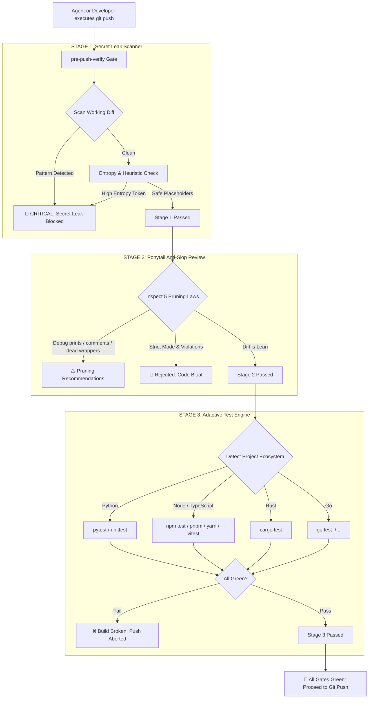

<div align="center">

# 🛡️ pre-push-verify

### **The Autonomous Security & Anti-Slop Firewall for AI Coding Agents**

*Stop API key leaks, eliminate LLM code bloat, and verify regression tests before any commit or push hits GitHub.*

[](https://github.com/jeevesh2515/pre-push-verify/actions/workflows/ci.yml)
[](https://opensource.org/licenses/MIT)
[](https://python.org)
[-brightgreen.svg)](#-enterprise-privacy--zero-data-retention-guarantee)
[-purple.svg)](#-enterprise-privacy--zero-data-retention-guarantee)
[](https://github.com/jeevesh2515/pre-push-verify)
[](https://github.com/jeevesh2515/pre-push-verify/pulls)
[](https://github.com/jeevesh2515/pre-push-verify)

<p align="center">
  <a href="#-why-pre-push-verify">Why</a> •
  <a href="#-enterprise-privacy--zero-data-retention-guarantee">Privacy & Zero Retention</a> •
  <a href="#-terminal-demo">Demo</a> •
  <a href="#-architecture">Architecture</a> •
  <a href="#-quickstart">Quickstart</a> •
  <a href="#-the-5-ponytail-pruning-laws">The 5 Laws</a> •
  <a href="#-supported-agents">Supported Agents</a> •
  <a href="#-ci-cd-integration">CI/CD</a>
</p>

---

</div>

## 💡 Why pre-push-verify?

Autonomous AI coding agents (Claude Code, Google Antigravity, Cursor, Windsurf, OpenCode, Codex, Devin) write code 10x faster than humans.

**However, they introduce three critical enterprise risks:**
1. **Accidental Secret Leaks**: Agents generate inline `sk-ant-...`, `sk-...`, `AKIA...`, or `gsk_...` keys during rapid local debugging and push them straight into public repositories.
2. **LLM Code Slop & Bloat**: Agents invent speculative abstractions, leave commented-out draft code, generate redundant wrapper helpers, and import heavy packages for tasks solved by standard library one-liners.
3. **Silent Test Regressions**: Fast iterations break subtle edge cases that never get caught until CI fails or production crashes.

**`pre-push-verify` fixes this permanently.** It acts as an uncompromising pre-push and pre-commit firewall. It analyzes only the working `git diff HEAD`, scans for 30+ secret patterns with Shannon entropy detection, enforces the **5 Ponytail Pruning Laws**, executes your project's native test suite, and blocks the push if anything fails.

---

## 🔒 Enterprise Privacy & Zero Data Retention Guarantee

> **Your code, your credentials, and your intellectual property NEVER leave your machine.**

Unlike cloud-based linters or SaaS security scanners that upload your codebase and diffs to external ingestion servers, `pre-push-verify` is built from the ground up on a **100% Local-First, Zero-Trust Architecture**:

| Security Invariant | Guarantee | Technical Implementation |
|---|---|---|
| **0% Data Retention** | Guaranteed | No files, diffs, AST logs, code hashes, or detected credentials are ever stored in remote databases or disks. |
| **100% Local CPU Execution** | Guaranteed | All regular expressions, Shannon entropy calculations, and test runners execute exclusively in the local machine process. |
| **Zero Telemetry / No Tracking** | Guaranteed | Absolutely no tracking pixels, analytics beacons, Sentry, Mixpanel, or phone-home pings. Completely air-gap compatible. |
| **In-Memory Masking** | Guaranteed | All detected secret tokens are redacted (`***REDACTED***`) before printing to terminal output or JSON, preventing terminal history and CI log pollution. |
| **Enterprise Compliance** | Ready | Safe for use in strictly regulated environments: **SOC2**, **HIPAA**, **GDPR**, **ISO 27001**, defense, and banking. |

---

## ⚡ Terminal Demo

```bash
$ pre-push-verify --strict
```

```ansi
========================================================================
     ___ ___ ___ ___ _   _ ___ _  _   __   _____ ___ ___ _____   __
    | _ \ _ \ __| _ \ | | / __| || |  \ \ / / __| _ \_ _| __\ \ / /
    |  _/   / _||  _/ |_| \__ \ __ |   \ V /| _||   /| || _| \ V / 
    |_| |_|_\___|_|  \___/|___/_||_|    \_/ |___|_|_\___|_|   |_|  
========================================================================
           Automated Agent Security & Anti-Slop Verification Gate
   [🔒 100% Local-First • 🛡️ 0% Data Retention • Zero External Telemetry]
========================================================================

🔍 [1/3] Scanning git diff for secrets & credential leaks...
   ✓ 0 secrets found. Clean!

✂️  [2/3] Inspecting diff for AI code bloat (Ponytail Laws)...
   ⚠️  [PRUNE] Found 1 opportunity to cut bloat:
      - [Line 42]: [DELETE] Temporary debug print statement found in diff.
   💡 Run pruning to keep diff lean and maintainable.

🧪 [3/3] Running automated regression tests...
   Detected runner: pytest
   Command: pytest tests/ -q
   ..................................................               [100%]
   ✓ Tests passed successfully (14 passed in 0.11s)

========================================================================
  🚀 VERIFICATION PASSED — "Lean already. Ship."
========================================================================
```

---

## 🏗️ Architecture



---

## 🚀 Quickstart

You can use `pre-push-verify` in 3 distinct modes:

### 1. As an AI Agent Skill (`/pre-push-verify`)

Install the agent skill into your workspace so Claude Code, Antigravity, OpenCode, or Cursor can invoke it autonomously before pushing:

```bash
# In your project repository:
mkdir -p .agents/skills/pre-push-verify
curl -sSL https://raw.githubusercontent.com/jeevesh2515/pre-push-verify/main/skills/pre-push-verify/SKILL.md \
  -o .agents/skills/pre-push-verify/SKILL.md
```

Now, prompt your agent or type the slash command:
> `"/pre-push-verify"` or `"verify security and run pre-push checks"`

The agent will automatically scan the diff, prune dead code, run tests, and only push if 100% clean!

---

### 2. Install as a Git Pre-Push Hook (Zero Friction)

Prevent anyone (including yourself and local agents) from pushing bad code to GitHub:

```bash
# Option A: Via Python CLI
pip install git+https://github.com/jeevesh2515/pre-push-verify.git
pre-push-verify --install-hook

# Option B: Via NPX (Node / JS environments)
npx pre-push-verify --install-hook
```

This installs `.git/hooks/pre-push`. Whenever `git push` runs, `pre-push-verify` executes automatically!

---

### 3. As a Standalone CLI

```bash
# Install locally
git clone https://github.com/jeevesh2515/pre-push-verify.git
cd pre-push-verify
pip install -e .

# Run manual verification
pre-push-verify

# Enforce strict zero-warning mode
pre-push-verify --strict

# Skip long-running tests during rapid local iterations
pre-push-verify --skip-tests

# Output machine-readable JSON for agent parsing
pre-push-verify --json
```

---

## ✂️ The 5 Ponytail Pruning Laws

Inspired by the Ponytail philosophy (*"The best code is the code never written"*), `pre-push-verify` actively guards against LLM over-engineering:

| Law | Principle | What Gets Flagged & Pruned |
|---|---|---|
| **1. `delete`** | Dead Code & Speculative Features | Unused variables, leftover debug logs (`console.log`, `print()`), commented blocks, speculative abstractions built for hypothetical future needs. |
| **2. `stdlib`** | Reinvented Wheels | Custom padding/math/datetime/path helpers when `pathlib`, `itertools`, `collections`, or native JS `URL`/`Array` already solve it. |
| **3. `native`** | Platform Over Dependency | Heavy external npm/pip packages imported for single operations where standard browser/Node/Python primitives suffice. |
| **4. `yagni`** | Premature Abstractions | Single-implementation interfaces, 3-layer deep wrapper classes, factory patterns around single functions. |
| **5. `shrink`** | Logic Condensation | Verbose 20-line if-else ladders that can be written in 3 clear, idiomatic lines without sacrificing readability. |

> **Non-Negotiable Safety Invariants**: `pre-push-verify` never cuts security checks, tenant-isolation filters (`tenant_id`), error handling, or test assertions.

---

## 🔐 30+ Built-in Secret Scanners

`pre-push-verify` detects high-risk credentials across all major AI and Cloud providers before they leak:

- **AI Providers**: OpenAI (`sk-...`), Anthropic (`sk-ant-...`), Groq (`gsk_...`), HuggingFace (`hf_...`), Cohere, Pinecone
- **Cloud Infrastructure**: AWS (`AKIA...`), Google Cloud Service Accounts, Azure Client Secrets
- **Payment & SaaS**: Stripe Live Keys (`sk_live_...`), GitHub PATs (`ghp_...`), GitLab Personal Tokens, Slack Tokens, Discord Bots
- **Databases & Crypto**: Postgres / MySQL / MongoDB connection URIs, RSA/SSH/PGP Private Key Headers
- **Heuristic Engine**: Shannon Entropy calculation for unstructured base64/hex token detection.

---

## 🤖 Supported Agents & Tools

| Agent / Tool | Integration Method | Capability |
|---|---|---|
| **Google Antigravity** | `.agents/skills/pre-push-verify` | Native Slash Command `/pre-push-verify` |
| **Claude Code** | `~/.claude/commands/pre-push-verify` | Slash Command `/pre-push-verify` |
| **Cursor / Windsurf** | Pre-push Git Hook | Automatic gate before push from editor |
| **GitHub Actions** | CI Workflow | Pull Request and Branch Protection Gate |
| **OpenCode / Codex** | CLI execution | Subprocess & Tool Calling verification |

---

## 🔄 CI/CD Integration

Add `pre-push-verify` to your GitHub Actions workflow to block PRs containing secrets or slop:

```yaml
# .github/workflows/verify.yml
name: Pre-Push Verify Gate

on: [push, pull_request]

jobs:
  verify:
    runs-on: ubuntu-latest
    steps:
      - uses: actions/checkout@v4
        with:
          fetch-depth: 0

      - name: Set up Python
        uses: actions/setup-python@v5
        with:
          python-version: "3.12"

      - name: Install pre-push-verify
        run: pip install git+https://github.com/jeevesh2515/pre-push-verify.git

      - name: Run Verification
        run: pre-push-verify --strict
```

---

## 🤝 Contributing

Contributions are warmly welcomed! If you want to add new secret patterns, support new test runners, or refine Ponytail pruning heuristics:

1. Fork the repo (`https://github.com/jeevesh2515/pre-push-verify`)
2. Create your feature branch (`git checkout -b feature/new-scanner`)
3. Commit your changes (`git commit -m 'feat: add Databricks token scanner'`)
4. Verify tests pass (`pytest tests/ -v`)
5. Push to the branch (`git push origin feature/new-scanner`)
6. Open a Pull Request!

---

## 🌟 Show Your Support

If `pre-push-verify` saved your repository from an API key leak or pruned AI slop from your codebase, please consider **giving this repo a star ⭐️!** It helps other AI engineers discover the project.

---

## 📜 License

Distributed under the **MIT License**. See [LICENSE](LICENSE) for details.

Built with passion for the AI Engineering community by [Jeevesh Singale](https://github.com/jeevesh2515).
